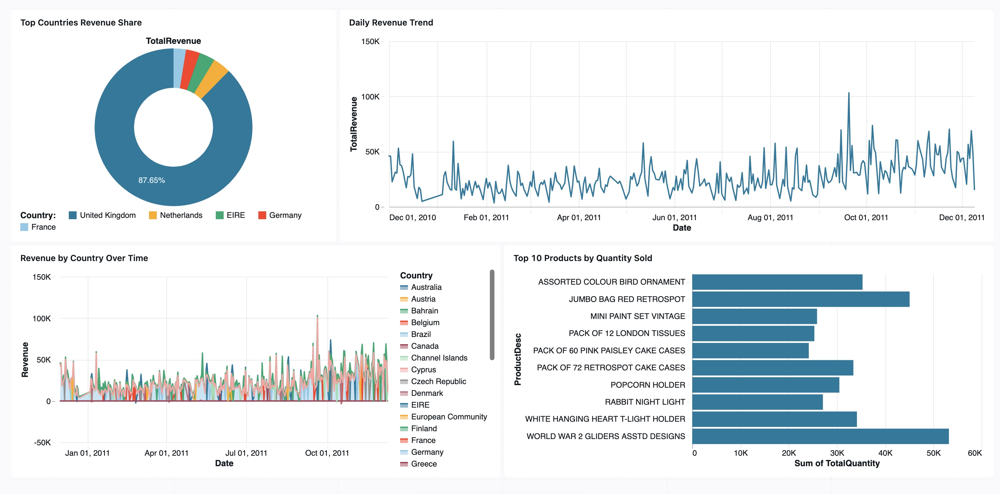
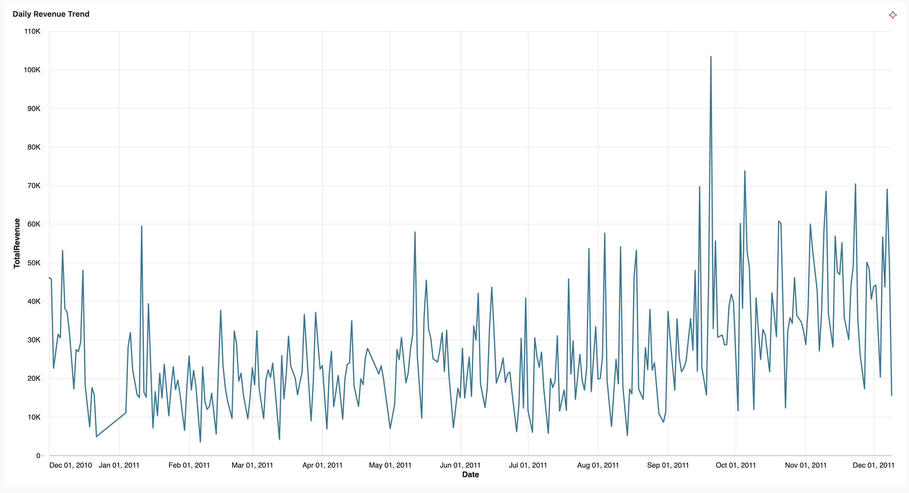
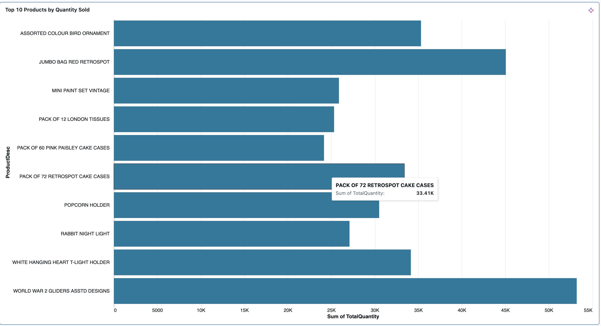
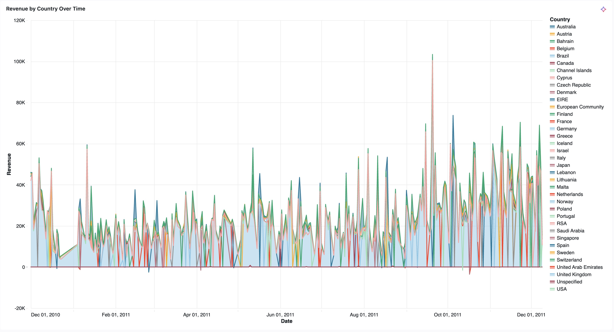

# 📘 Azure Databricks Retail Analytics Lakehouse

## 🚀 Project Overview

This project demonstrates a **production-style Lakehouse pipeline** on **Azure Databricks** using an open **Online Retail dataset**.

It follows the **Bronze → Silver → Gold** architecture with **Delta Lake**, and ends with interactive **Databricks SQL dashboards** plus **Python visualizations**.

### Goals

* Ingest raw CSV data from **Azure Data Lake Storage Gen2**
* Store in Delta Lake Bronze, then clean in Silver
* Aggregate business insights into Gold tables
* Visualize with **Matplotlib** and **Databricks SQL dashboards**

---

## 🏗️ Architecture

```
Raw CSV (ADLS Gen2)
        │
        ▼
 Bronze (Raw Delta)    → stored as-is, schema-on-read
        │
        ▼
 Silver (Cleaned Delta) → casted types, cleaned nulls, renamed cols
        │
        ▼
 Gold (Curated Delta)   → Daily Revenue, Top Products, Aggregates
        │
        ▼
 Dashboards (Databricks SQL + Matplotlib)
```

---

## 📂 Repository Structure

```
docs/
 └── dashboard_screenshots/
     ├── dashboard_overview.png
     ├── daily_revenue_trend.png
     ├── top_countries.png
     ├── top_products.png
     └── revenue_heatmap.png

notebooks/
 ├── 01_ingest_bronze_batch.ipynb
 ├── 01_ingest_bronze_autoloader.ipynb
 ├── 02_transform_silver_cleaning.ipynb
 ├── 03_gold_aggregations.ipynb
 └── 04_analysis_visualization.ipynb

queries/
 ├── daily_revenue_trend.dbquery.ipynb
 ├── revenue_by_country_over_time.dbquery.ipynb
 ├── top_countries_total_revenue.dbquery.ipynb
 ├── top_products_quantity.dbquery.ipynb
 └── top_countries_share.dbquery.ipynb

README.md
```

---

## 🔎 Notebooks

1. **01 – Bronze (Raw Ingestion)**
   * Ingests CSV files from ADLS Gen2
   * Saves to `retail_bronze` Delta table (batch + streaming/autoloader)

2. **02 – Silver (Cleaning & Standardization)**
   * Casts columns (`Quantity`, `UnitPrice`, `InvoiceDate`)
   * Fixes decimal separators, timestamps
   * Drops nulls & renames columns
   * Inspects `_delta_log` for versioning and transactions

3. **03 – Gold (Aggregations)**
   * Builds business-ready metrics:
     * `retail_gold_daily_sales` → revenue per country/day
     * `retail_gold_top_products` → top products by sales quantity

4. **04 – Analysis & Visualization**
   * Matplotlib visualizations:
     * Daily revenue trend (with 7-day moving average)
     * Top 10 countries by revenue
     * Revenue distribution histogram
     * Top 10 products by quantity sold

---

## 📊 Databricks SQL Dashboard

Here are some visuals generated from Gold tables:






You can find the SQL queries in the [queries/](queries/) folder.

### Visuals Included

* Daily Revenue Trend with 7-day Moving Average
* Top 10 Countries by Revenue
* Top Products by Quantity Sold
* Revenue Heatmap by Country/Day
* Monthly Revenue Growth

---

## 🧾 SQL Queries

All queries powering the dashboard are stored in [`/queries/`](queries/).

Example – **Daily Revenue Trend**:

```sql
SELECT Date, SUM(Revenue) AS TotalRevenue
FROM retail_gold_daily_sales
GROUP BY Date
ORDER BY Date;
```

---

## 📌 Technologies Used

* **Azure Databricks** (PySpark, Delta Lake, Unity Catalog, SQL)
* **Azure Data Lake Storage Gen2 (ADLS)**
* **Matplotlib** (Python visualization)
* **Databricks SQL Dashboards**

---

## 🎯 Key Learnings

* Built an end-to-end **Lakehouse pipeline**
* Learned **Delta Lake internals** (`_delta_log`, tombstones, time travel)
* Designed **business-ready Gold tables**
* Created an **executive-style dashboard** combining SQL + Python visuals

---

## 📌 How to Run

1. Upload notebooks from `/notebooks/` into your **Databricks workspace**
2. Configure ADLS external location for Delta tables
3. Run notebooks sequentially:
   * `01_ingest_bronze_batch.ipynb` or `01_ingest_bronze_autoloader.ipynb`
   * `02_transform_silver_cleaning.ipynb`
   * `03_gold_aggregations.ipynb`
   * `04_analysis_visualization.ipynb`
4. In Databricks SQL → import queries from `/queries/` and build the dashboard

---

✨ This project shows how to build a **real-world analytics solution** on Azure Databricks.
It's end-to-end: **Ingestion → Transformation → Aggregation → Visualization**.